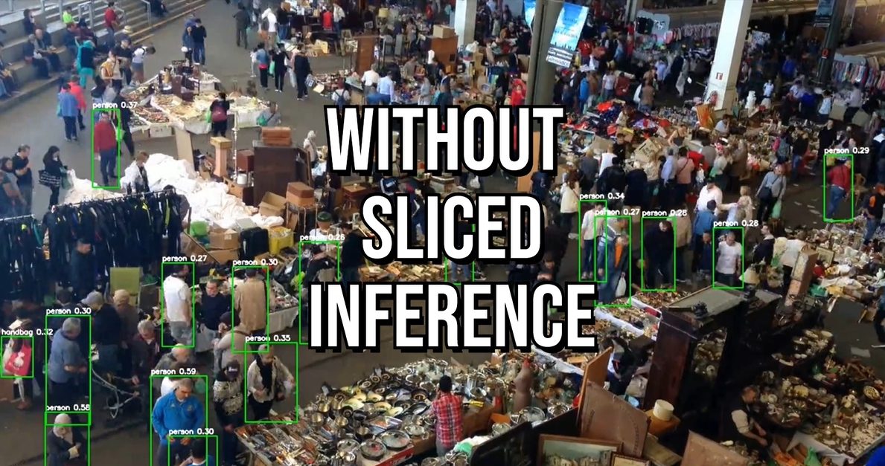
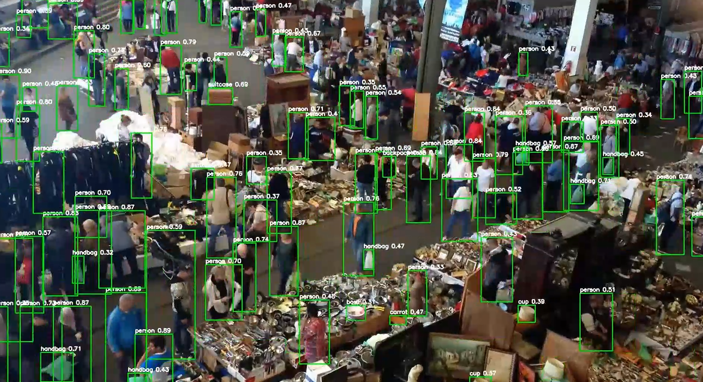

# Improve-Small-Object-Detection-Accuracy-with-Sliced-Inference

This repository implements real-time object detection on video files using [Ultralytics YOLOv8](https://github.com/ultralytics/ultralytics) combined with [SAHI (Slicing Aided Hyper Inference)](https://github.com/obss/sahi) for improved accuracy on large images or crowded scenes.

---

## Features

- **Sliced inference** using SAHI for better detection on large frames or small objects.
- Detects objects with YOLOv8 pre-trained or custom models.
- Processes input video frame-by-frame with bounding boxes, labels, and confidence scores.
- Saves annotated output as a new video file.
- Optional real-time display during inference.
- Easy to customize slice sizes and device selection (CPU/GPU).

---

## Example Output
### Without SAHI

### With SAHI Implementation


## Demo
[Watch the demo on YouTube](https://youtu.be/qZq9K0Fo5Ns)
## Requirements

- Python 3.8+
- Ultralytics YOLO (`ultralytics` package)
- SAHI (`sahi` package, latest dev version recommended)
- OpenCV (`opencv-python`)
- PyTorch (compatible with your CUDA version or CPU)

---

## Installation

Clone the repository and install dependencies:

```bash
git clone https://github.com/TLILIFIRAS/Improve-Small-Object-Detection-Accuracy-with-Sliced-Inference.git
cd Improve-Small-Object-Detection-Accuracy-with-Sliced-Inference

```

> **Note:**  
> SAHI’s latest YOLOv8 support may require installing directly from GitHub:  
> ```bash
> pip uninstall sahi -y
> pip install git+https://github.com/obss/sahi.git@main
> ```

---

## Usage

Edit the script or run the detection script directly after placing your input video (`crowd.mp4`) in the working directory.

```bash
python your_detection_script.py
```

---

## Script Highlights

- Loads YOLOv8 model with SAHI’s `AutoDetectionModel`.
- Reads video frames and performs sliced inference.
- Draws bounding boxes and labels with confidence scores.
- Saves output video as `crowd_output_sahi.mp4`.
- Optional real-time display (comment/uncomment lines in code).

---

## Customization

- Change input video path by editing `cap = cv2.VideoCapture("your_video.mp4")`.
- Modify slice size in `get_sliced_prediction()` by adjusting `slice_height` and `slice_width`.
- Switch device by changing device selection logic (`cpu` or `cuda:0`).
- Enable real-time display by uncommenting the `cv2.imshow()` and keypress break code.

---

## Example Output
### Without SAHI

### With SAHI Implementation


---

## References

- [Ultralytics YOLOv8](https://github.com/ultralytics/ultralytics)
- [SAHI - Slicing Aided Hyper Inference](https://github.com/obss/sahi)
- [OpenCV](https://opencv.org/)

---

## License

MIT License © 2025 Your Name

---
